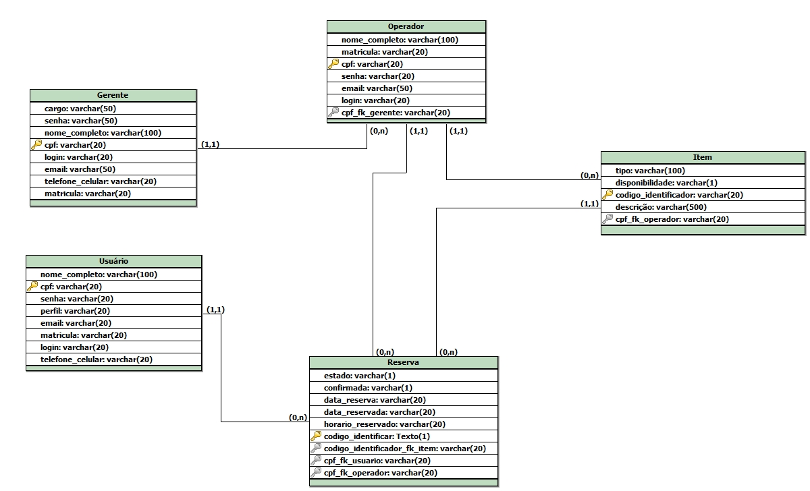

<h1> Sistema de Reservas</h1>
<h2>Equipe:</h2>

  Alvanir ​ ​Junior. 
  Carlos ​ ​Augusto. 
  Emmanuel ​ ​Diego. 
  Ademário ​ ​José. 
  Pedro ​ ​Gabriel. 

<h2>​ ​​ ​​Descrição ​ ​do ​ ​Projeto:</h2>
Com ​ ​uma ​ ​análise ​ ​em ​ ​alguns ​ ​problemas ​ ​que ​ ​são ​ ​apresentados ​ ​na
universidade, ​ ​foi ​ ​se ​ ​visto ​ ​a ​ ​necessidade ​ ​de ​ ​alguma ​ ​aplicação ​ ​de ​ ​reserva ​ ​de
equipamentos(Salas, ​ ​laboratórios, ​ ​auditórios, ​ ​projetores ​ ​e ​ ​entre ​ ​outros...) ​ ​mais
rápido ​ ​e ​ ​prático. ​ ​Tendo ​ ​em ​ ​vista ​ ​a ​ ​grande ​ ​dificuldade ​ ​que ​ ​se ​ ​é ​ ​apresentada ​ ​para
que ​ ​​ ​se ​ ​possa ​ ​ocorrer ​ ​uma ​ ​reservas ​ ​sem ​ ​que ​ ​ocorra ​ ​qualquer ​ ​tipo ​ ​de ​ ​problema
futuro.
Assim ​ ​surgiu ​ ​a ​ ​ideia ​ ​de ​ ​uma ​ ​aplicação ​ ​que ​ ​irá ​ ​auxiliar ​ ​tanto ​ ​aqueles ​ ​que ​ ​são
responsáveis ​ ​pela ​ ​organização ​ ​dos ​ ​equipamentos, ​ ​tanto ​ ​para ​ ​os ​ ​que ​ ​irão ​ ​fazer ​ ​uso
do ​ ​mesmo, ​ ​tento ​ ​em ​ ​vista ​ ​que ​ ​será ​ ​algo ​ ​que ​ ​contará ​ ​com ​ ​sistema ​ ​de ​ ​gerenciamento
detalhado, ​ ​sobre ​ ​o ​ ​dia ​ ​da ​ ​reserva, ​ ​o ​ ​professor ​ ​ou ​ ​qualquer ​ ​outro ​ ​que ​ ​tenha
solicitado ​ ​tal ​ ​ferramenta, ​ ​a ​ ​reserva ​ ​poderá ​ ​ser ​ ​realizada ​ ​de ​ ​maneira ​ ​online ​ ​com
necessidade ​ ​apenas ​ ​de ​ ​um ​ ​simples ​ ​cadastro ​ ​em ​ ​nosso ​ ​sistema, ​ ​além ​ ​de ​ ​apresentar
um ​ ​histórico ​ ​sobre ​ ​últimos ​ ​acesso ​ ​aos ​ ​equipamentos ​ ​que ​ ​foram ​ ​reservados, ​ ​com
isso ​ ​apresentando ​ ​um ​ ​controle ​ ​ainda ​ ​maior ​ ​na ​ ​manutenção ​ ​dos ​ ​mesmo ​ ​e ​ ​uma
relação ​ ​de ​ ​segura.
 
<h2>​ ​ ​Requisitos ​ ​do ​ ​Sistema:</h2>
1. O ​ ​Sistema ​ ​deve ​ ​exibir​ ​as ​ ​agendas ​ ​das ​ ​salas ​ ​na ​ ​forma ​ ​de ​ ​quadros
semanais,​ ​com ​ ​possibilidade ​ ​de ​ ​navegação​ ​por​ ​estes.
 
2. O ​ ​Sistema ​ ​deve ​ ​possibilitar​ ​a ​ ​exibição​ ​de ​ ​maiores ​ ​informações ​ ​sobre ​ ​uma
reserva ​ ​a ​ ​qualquer​ ​momento.
 
3. O ​ ​Sistema ​ ​deve ​ ​exibir​ ​as ​ ​reservas ​ ​classificadas ​ ​em ​ ​tipos,​ ​a ​ ​saber: ​ ​Aula,
Palestra,​ ​Conselho,​ ​Comissão,​ ​Seminário,​ ​Reunião,​ ​Monitoria,​ ​Outros.
 
4. O ​ ​Sistema ​ ​deve ​ ​oferecer​ ​dois ​ ​tipos ​ ​de ​ ​reservas: ​ ​eventuais ​ ​e ​ ​fixas
semanalmente.​ ​As ​ ​reservas ​ ​eventuais ​ ​terão​ ​vigência ​ ​somente ​ ​na ​ ​data ​ ​e
horário​ ​em ​ ​que ​ ​foram ​ ​marcadas,​ ​e ​ ​as ​ ​fixas ​ ​serão​ ​ligadas ​ ​a ​ ​um ​ ​dia ​ ​da
semana ​ ​e ​ ​horário,​ ​e ​ ​se ​ ​repetirão​ ​semanalmente.
 
5. O ​ ​Sistema ​ ​deve ​ ​permitir​ ​que ​ ​os ​ ​usuários ​ ​com ​ ​permissão​ ​de ​ ​agendamento
comum ​ ​sobre ​ ​as ​ ​equipamentos ​ ​possam ​ ​incluir,​ ​excluir​ ​e ​ ​modificar
reservas ​ ​eventuais.
 
6. O ​ ​Sistema ​ ​deve ​ ​permitir​ ​que ​ ​sejam ​ ​feitas ​ ​buscas ​ ​por​ ​equipamentos ​ ​com
horários ​ ​livres ​ ​para ​ ​reservas ​ ​eventuais.
 
7. O ​ ​Sistema ​ ​deve ​ ​registrar,​ ​no​ ​momento​ ​do​ ​agendamento​ ​de ​ ​uma ​ ​reserva,​ ​a
data,​ ​hora ​ ​e ​ ​a ​ ​pessoa ​ ​que ​ ​a ​ ​efetuou.
<h1>Documentação</h1>
<h2><a href= "Documentos do projeto/Declaracao_de_originalidade.pdf">Declaração de Originalidade</a></h2>
<h2><a href= "Documentos do projeto/Documento-de-visao.pdf">Documento de visão</a></h2>
<h2><a href= "Documentos do projeto/Manual do Usuário Final.pdf">Manual do Usuário</a></h2>

<h1>Banco de dados</h1>
<h2>Modelo entidade relacionamento</h2>

<h2>Diagrama entidade relacionamento</h2>

<h2><a href= "Documentos do projeto/Dicionário de Dados.pdf">Dicionário de dados</a></h2>
<h2><a href= "Documentos do projeto/script_ddl.sql">Script de criação de tabelas do banco de dados</a></h2>
<h1 href="Sistema/">Código fonte do projeto</h1>
